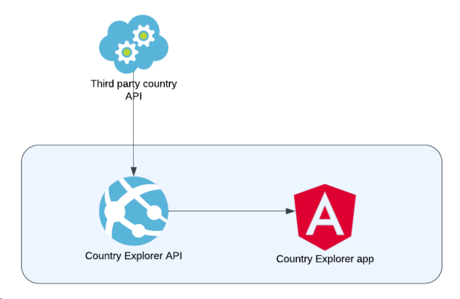

# Country Explorer
Test application that displays a listing of country information

## How to run application
Application consists of two parts: Backend and Frontend. Below you can find instructions how to run both of them.

### Backend application (.NET Core Web API)
To run backend application locally you need

Visual Studio  
.NET 6.0 SDK

Navigate to `src\CountryExplorer.Api` and open solution file with VS.  
Select `CountryExplorer.Api` launch profile (if not already selected) and run application in `Debug` mode (or press F5).

### Frontend application (Angular)
To run frontned application locally you need

Visual Studio Code  
Angular CLI: 17.0.7  
Node: 18.17.1

Navigate to `src\CountryExplorer.Ui` and open it in VS Code.  
Open new terminal and run `npm install` to install required packages.  
Finally run `npm start` in your terminal (or press F5) to start your application.  
When compiled successfully you can browse this application under `http://localhost:4200/`.

# Design choices
The high-level design for the application is shown in the diagram below:

### Layered Architecture
Each layer of the layered architecture pattern has a specific role and responsibility within the application.  
The backend application has 4 layers:

**Presentation/API layer**  
Presentation layer is responsible for handling all user interface and browser communication logic. To decrease server load it provides cach responses.

**Business Logic layer**  
This layer is responsible for handling all requests and its validation, also preparation of response and handling errors.

**Infrastructure/Services layer**  
This layer is responsible for data retrieval from third party provider (kind of database) and mapping it to domain models. Contains implementation of domain services.

**Domain layer**  
This layer contains description of domain models and service interfaces.

Each layer of the layered architecture pattern described above is isolated and responsible for specific logic. For example, a domain layer provides only models and service interfaces and does not know about infrastructure layer, whereas a services layer provides implementation of service interfaces and communication with third party provider (has no clue about business logic layer). Similarly, a business logic layer isn't aware about presentation layer, contains business requests, validation rules and request handlers. Finally, a presentation layer (API) provides interface for communication and use business layer to process requests. 

# What could be improved
There is always room for improvement and current application is not an exception.  
For example, adding a database to store response from third party service will reduce the risk of system downtime due to an issue with third party service. It also could improve performance of the application by reducing time for processing requests. To make sure that required data (countries data) is always up to date it makes sence to implement synchronization logic via backround serices which would retrieve data from third party service and store/update it within databse periodically (e.g. each day).

